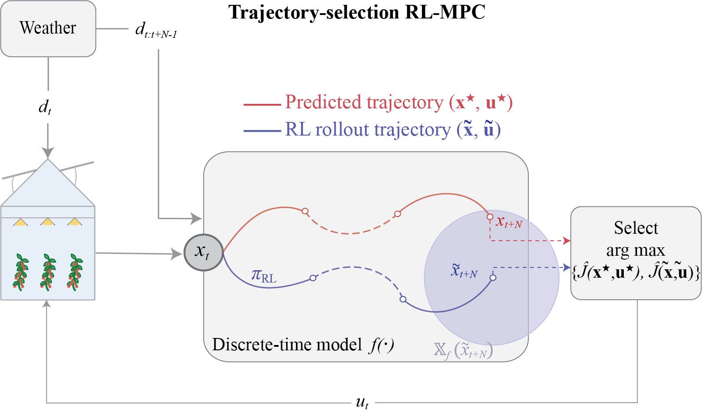

# Trajectory-Selection RL-MPC for Greenhouse Fruit Production

<p align="center">
  
</p>

## Introduction

This repository contains the code used for the preprint **Improving greenhouse fruit-production control by integrating reinforcement learning into short-horizon model predictive control**.

📄 Preprint: [https://arxiv.org/abs/2607.07365](https://arxiv.org/abs/2607.07365)

✏ author: Bart van Laatum

📧 e-mail: bart.vanlaatum@wur.nl

The code implements **trajectory-selection RL-MPC**: a short-horizon nonlinear MPC that uses an RL rollout to define a terminal-region constraint and a terminal cost, then selects and applies the first input from whichever trajectory (MPC or RL) has the better objective value. 
The employed greenhouse prediction model is [**GreenLight**](https://github.com/davkat1/GreenLight), a large-scale tomato production model, and is used for MPC optimization, RL training, and closed-loop simulations.

<!-- The CasADi implementation used here lives in [`model/`](model/). Environment, reward, and observation code wrap this model; the dynamics themselves are defined only in `model/`. -->

## Prerequisites

Before installing this project, ensure you have:

* A virtual environment with **Python 3.11** (Anaconda/Miniconda recommended)
* A **Weights & Biases (wandb)** account (free tier is sufficient)
  * Create an account at [wandb.ai](https://wandb.ai)
  * After installation, run `wandb login` and enter your API key
  * Training scripts use wandb to log runs and assign unique model names

## Installation

1. Clone the repository and create a Python 3.11 environment.

2. Install Python dependencies and this repository:

```bash
pip install -r requirements.txt
pip install -e .
```

3. Install **IPOPT** separately (not provided via `pip`):

```bash
conda install -c conda-forge ipopt
```

### Linear solver: MA57 vs MUMPS

This codebase is configured to use the **HSL MA57** linear solver inside IPOPT. MA57 is **not** bundled with IPOPT; you need a (academic) HSL licence and a matching IPOPT build.

If you **do not** have MA57, switch to the more common **MUMPS** solver in [`configs/controllers/mpc.yml`](configs/controllers/mpc.yml):

```yaml
linear_solver: "mumps"   # default in this repo is "ma57"
```

Leave `linear_solver: "ma57"` only if MA57 is actually available on your machine. Using `"ma57"` without the library will make IPOPT fail at solve time.

Run scripts from the repository root so relative paths to `configs/` and `weather/` resolve.

## Project Structure

```
GL-Gym-MPC/
│
├── common/           # helpers: wandb, env loading, callbacks, results
├── configs/          # environment, PPO, and MPC (IPOPT) settings
├── controllers/      # MPC, RL-MPC, and rule-based controllers
├── environments/     # Gymnasium wrappers around the GreenLight model
├── experiments/      # train / evaluate RL, MPC, and RL-MPC
├── model/            # GreenLight dynamics, auxiliary states, parameters
├── run_scripts/      # bash scripts for the paper experiments
├── weather/          # outdoor weather trajectories (Netherlands, 2011–2020, 2023)
├── README.md
└── requirements.txt
```

* **`model/`**: GreenLight ODE, auxiliary algebraic relations, and default parameters. This is the plant model used by both the simulator and the MPC predictor.
* **`configs/`**: `envs/TomatoEnv.yml` (episode length, constraints, prices), `controllers/ppo.yml` (PPO hyperparameters), `controllers/mpc.yml` (**IPOPT options and linear solver**).
* **`experiments/`**: entry points for training and closed-loop evaluation.
* **`run_scripts/`**: ready-made commands that match the preprint simulation setup.

## Complete Workflow Overview

Typical workflow for reproducing the paper-style simulations:

1. **Train** a PPO policy (wandb assigns a model name).
2. **Evaluate** the standalone RL policy.
3. **Evaluate** short-horizon MPC.
4. **Evaluate** trajectory-selection RL-MPC (terminal constraint, terminal penalty, selector).

Results are written under `results/`. Trained policies and VecNormalize stats are written under `train_data/`.

## Usage: Step-by-Step Guide

Run everything from the **repository root**. Replace `YOUR-MODEL-NAME` with the wandb run name of your trained policy (for example `daily-glade-107`).

### Shared arguments

These flags appear in several evaluation scripts. They select *which outdoor weather trajectory* the greenhouse is simulated against, and *when* in the year the episode starts.

| Argument | Meaning |
|---|---|
| `--location` | Weather dataset / greenhouse site. Must match a folder under `weather/`. The paper uses `Netherlands`. |
| `--growth_year` | Calendar year of that weather file, e.g. `2023` loads `weather/Netherlands/2023.csv`. Available years: 2011–2020 and 2023. |
| `--start_day` | Day of year on which the episode begins (0 = 1 January). |
| `--project` | Name used for wandb logging and for the `train_data/` / `results/` folder tree. |
| `--env_id` | Gym environment. Keep `TomatoEnv`. |
| `--algorithm` | RL algorithm. The paper uses `ppo`. |
| `--model_name` | Wandb run name of a trained policy, needed to load weights from `train_data/`. |
| `--horizon` | MPC prediction horizon in **hours** (`1` is the short horizon used in the paper). |
| `--experiment_name` | Label for the output folder under `results/`. Choose something unique per run. |
| `--frame_stack` / `--n_stack` | If set, the policy observes the last `n_stack` frames (paper: `--n_stack 2`). Use the same values as during training. |

Episode length (default **1 day**) is set by `season_length` in `configs/envs/TomatoEnv.yml`, not by a command-line flag.

### 1. Train an RL policy

```bash
./run_scripts/rl_training.sh
```

or equivalently:

```bash
python experiments/train_rl.py \
    --project <YOUR-PROJECT-NAME> \
    --env_id TomatoEnv \
    --algorithm ppo \
    --n_eval_episodes 1 \
    --n_evals 20 \
    --save_model \
    --save_env \
    --frame_stack \
    --n_stack 2 \
```

* `--n_evals`: how many times the policy is evaluated during training.
* `--n_eval_episodes`: evaluation episodes at each of those checkpoints.
* `--save_model` / `--save_env`: write the policy and VecNormalize stats (needed later for RL-MPC).

Policies are saved to `train_data/<YOUR-PROJECT-NAME>/ppo/deterministic/models/<MODEL_NAME>/`. After training, note the wandb model name.

### 2. Evaluate the RL policy

Edit `run_scripts/rl_eval_years.sh` and set `model_name` to your wandb name, then:

```bash
./run_scripts/rl_eval_years.sh
```

or a single year/day:

```bash
python experiments/evaluate_rl.py \
    --project <YOUR-PROJECT-NAME> \
    --env_id TomatoEnv \
    --model_name YOUR-MODEL-NAME \
    --algorithm ppo \
    --uncertainty_scale 0 \
    --mode deterministic \
    --frame_stack \
    --n_stack 2 \
    --location Netherlands \
    --growth_year 2023 \
    --start_day 151 \
```

* `--mode deterministic` and `--uncertainty_scale 0`: closed-loop simulation with no parametric noise (as in the paper). Stochastic mode is unused for this submission.
* `--location`, `--growth_year`, `--start_day`: see [Shared arguments](#shared-arguments). Together they pick one outdoor weather episode, here the Netherlands on 31 May 2023.

### 3. Evaluate short-horizon MPC

Confirm IPOPT is installed and that `linear_solver` in `configs/controllers/mpc.yml` is either `"ma57"` or `"mumps"`.

```bash
python experiments/mpc_experiment.py \
    --horizon 1 \
    --experiment_name <YOUR-EXPERIMENT-NAME> \
    --location Netherlands \
    --growth_year 2023 \
    --start_day 151 \
```

`--horizon 1` is a 1-hour prediction window. Weather flags have the same meaning as for RL evaluation.

Output: `results/<YOUR-PROJECT-NAME>/deterministic/mpc/<YOUR-EXPERIMENT-NAME>/`

To sweep several weather years, see `run_scripts/mpc_solvers.sh` (update `YOUR-EXPERIMENT-NAME`, years, and start days as needed).

### 4. Evaluate trajectory-selection RL-MPC

This is the method from the paper: terminal region, terminal penalty, and selector between the MPC predicted trajectory and the RL rollout.

```bash
python experiments/rlmpc_experiment.py \
    --project <YOUR-PROJECT-NAME> \
    --env_id TomatoEnv \
    --algorithm ppo \
    --model_name YOUR-MODEL-NAME \
    --horizon 1 \
    --region_range 0.05 \
    --terminal_constraint \
    --terminal_penalty \
    --selector_mechanism \
    --normalize_x \
    --frame_stack \
    --n_stack 2 \
    --experiment_name <YOUR-RLMPC-EXPERIMENT-NAME> \
    --growth_year 2023 \
    --start_day 151 \
```

* `--region_range`: relative half-width of the terminal region around the RL rollout state (`0.05` = ±5%).
* `--terminal_constraint`: force the MPC predicted state at the horizon into that region.
* `--terminal_penalty`: add a terminal cost from the RL rollout.
* `--selector_mechanism`: after solving, apply the first input from whichever trajectory (MPC or RL) has the better objective.
* `--normalize_x`: scale states when forming the terminal region.

`--growth_year` and `--start_day` again select the weather episode. Location defaults to the environment config (`Netherlands`).

Output: `results/<YOUR-PROJECT-NAME>/deterministic/rlmpc/<YOUR-RLMPC-EXPERIMENT-NAME>/`

### 5. Optional: ablation of RL-MPC components

`run_scripts/ablation.sh` repeats the RL-MPC evaluation while turning off one component at a time (terminal constraint, terminal penalty, or selector). Update `model_name` first.

## Citation

If you find this repository and/or its accompanying preprint usefull, please cite it in your publications.
```bibtex
@misc{vanlaatum2026improving,
  title={Improving greenhouse fruit-production control by integrating reinforcement learning into short-horizon model predictive control},
  author={van Laatum, Bart and Msaad, Salim and van Henten, Eldert J. and McAllister, Robert D. and Boersma, Sjoerd},
  year={2026},
  eprint={2607.07365},
  archivePrefix={arXiv},
  primaryClass={math.OC},
  url={https://arxiv.org/abs/2607.07365}
}
```
